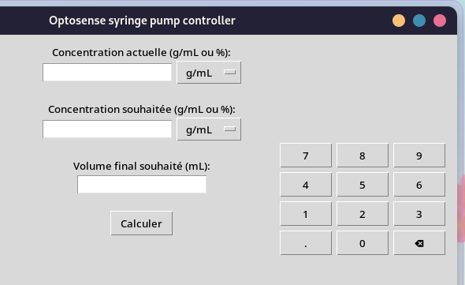

# optosense-pi

Code for controlling stepper motor through serial interface and interfacing with pyspectrometer.



## Installation

#### Clone the repository

```
git clone https://github.com/Optosense/optosense-pi.git
cd optosense-pi
```

#### Install the dependencies

- **tkinter** : `sudo apt install python-tk`
- **pyserial** : `pip install requirements.txt`

#### Make a shortcut in the desktop

```
mv interface.py ~/Desktop
chmod +x ~/Desktop/interface.py
```

## TODO:

- [ ] make a service that launch at startup
- [ ] better handling of serial communication
